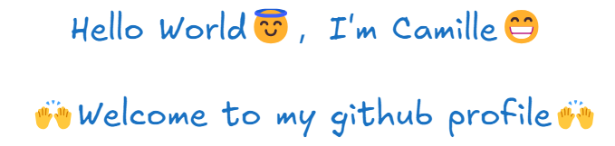

  

  &nbsp;
  &nbsp;
  &nbsp;
  &nbsp;
  &nbsp;
  &nbsp;
  &nbsp;
  

  &nbsp;
  

<!--
**chenchen112/chenchen112** is a ✨ _special_ ✨ repository because its `README.md` (this file) appears on your GitHub profile.

Here are some ideas to get you started:

- 🔭 I’ m currently working on ...
- 🌱 I’ m currently learning ...
- 👯 I’ m looking to collaborate on ...
- 🤔 I’ m looking for help with ...
- 💬 Ask me about ...
- 📫 How to reach me: ...
- 😄 Pronouns: ...
- ⚡ Fun fact: ...
-->
